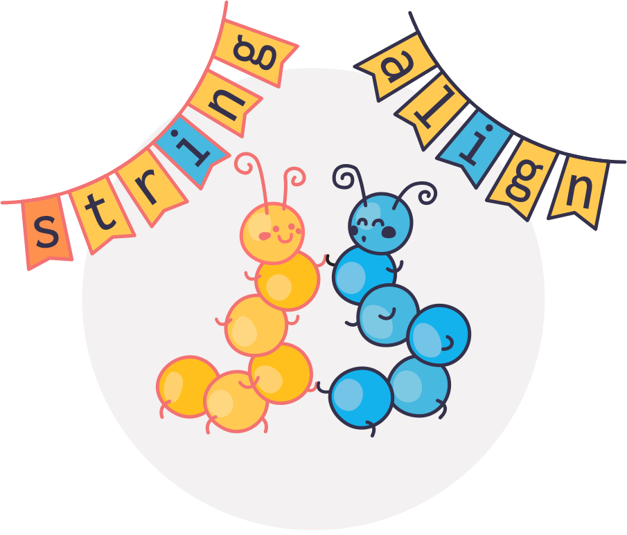

Stringalign
===========

**A string comparison library that adhers to the quirks of Unicode.**

Stringalign is a library for comparing strings.
At its base, Stringalign takes two strings, a reference string and a predicted string, and aligns them.
Based on this alignment, we can compute many interesting performance metrics, such as the edit distance (Levenshtein), error rates, common character replacements and much more.
By aggregating many such alignments, Stringalign facilitates exploration and evaluation of e.g. text and speech recognition models.

A tiny example
==============

For example, if the `reference` string is `Banana pancakes` and the `predicted` string is `bananana pancake`, then string align will align it

.. code::

    Reference: B--anana pancakes
   Prediction: bananana pancake-

This alignment is stored as a collection of *replacements*, *insertions*, *deletions* and *keeps*, that describe what we need to do with the predicted string to make it equal to the reference string. For the string above, we get

.. code:: python

   [Replaced('B', 'b'), Inserted('a'), Inserted('n'), Kept('a'), Kept('n'), Kept('a'), Kept('n'), Kept('a'), Kept(' '), Kept('p'), Kept('a'), Kept('n'), Kept('c'), Kept('a'), Kept('k'), Kept('e'), Deleted('s')]

or, if we join consequtive the `Deleted`, `Inserted` and `Replaced`:

.. code:: python

   [Replaced('B', 'ban'), Keep('anana pancake'), Deleted('s')]

Based on these alignments, we can compute standard string comparison metrics such as the :ref:`levenshtein_distance` and :ref:`character error rate <token_error_rate>`.
However, Stringalign also contains functions to do more in-depth analysis of the types of errors that occur when you have a whole collection of reference and predicted strings.
Examples of this is: the most common character confusions, the letters most often omitted in the prediction, the letters most often incorrectly included in the prediction, etc.
See the :ref:`example_gallery` for more examples of what you can use Stringalign for, or see :ref:`norhand_example` for a full walkthrough that shows how you can use Stringalign to understand the weaknessess of an automatic handwriting recognition model.

.. toctree::
   :maxdepth: 2
   :caption: Contents:

   installation
   concepts/index
   auto_examples/index
   api/index
   bibliography
